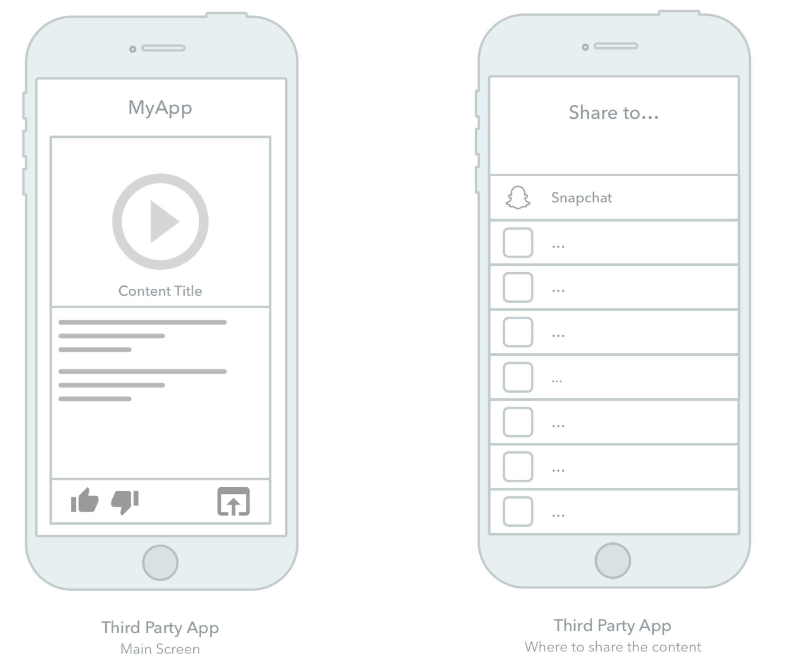
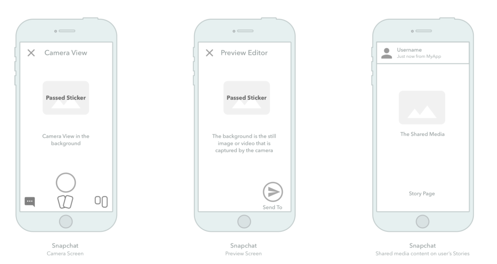
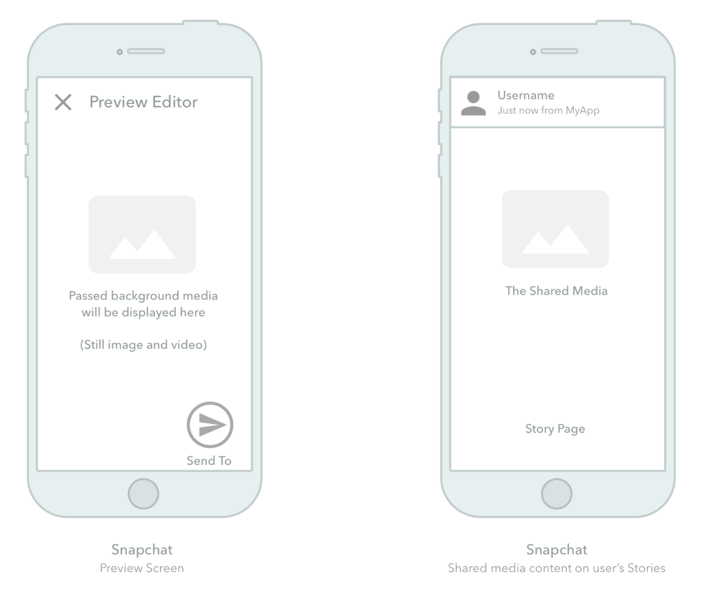

# Creative Kit Lite Samples


## What is Creative Kit Lite

Creative Kit makes sharing even more interactive!

Creative Kit allows users to share Lenses, AR Experiences, Filters, GIFs, videos, links, or captions from your website or app directly to Snapchat's camera or preview screen.

After the content is shared into Snapchat, users can apply any of Snapchat's creative tools to edit the shared content before sending it to their friends or stories.

With Creative Kit Lite you can add these features to your app, without having to download an SDK or increasing your app's binary size. Simply follow the code recommendations below. You can also check out the sample apps for iOS and Android in this repository for ready-to-deploy code samples. 

### Features
Creative Kit Lite supports three different user flows for sharing in to Snapchat:
- **Share to Camera**: Enable your users to share to Snapchat using the Snapchat Camera with a sticker overlay. After the user creates the Snap with the Snapchat Camera, the sticker overlay will appear and the user can add more creative tools (including filters, stickers and captions). Any background media
passed in this flow will be ignored.

- **Share to Preview**: Enable your users to share to Snapchat while bypassing the Snapchat Camera and with fullscreen
content dictated by your app (sticker and caption text are still an option). The user will be able to add more
creative tools to their Snap (including filters, stickers and captions).

- **Share to Lens**: Lenses provide the most flexibility for your share experience on Snapchat. Create the Lens in [Lens
Studio](https://ar.snap.com/lens-studio-dl) , point to the Lens with Creative Kit and pass through the Lens launch data parameters to personalize the experience for the sender. 

### Snap Developer Portal
Sharing of the content on Snapchat requires your app to be registered at [https://kit.snapchat.com/](https://kit.snapchat.com/) and prior approval from Snapchat. For more information on how to set up your app please see our [documentation](https://docs.snap.com/snap-kit/developer-portal/developing-your-app). You will need the Client ID obtained from the developer portal in order to use the features described below. 

### Share to Camera User Flow
The following diagram depicts the Share to Camera flow:




1. A user of your app taps a button to initiate the share and deep link to Snapchat.
2. Before the user is redirected to Snapchat, your app creates a sticker, a small asset that will be passed to Snapchat and be placed on top of the a Snap to be captured on Snapchat.
3. Redirect to Snapchat with using a custom URL scheme.
4. Snapchat is launched and the shared sticker is loaded onto the Camera screen from the Pasteboard. The user can take a
Snap with the Snapchat Camera (including AR Lenses), photo or video.
5. The user gets to edit the photo taken by the camera and the passed sticker on Snapchat Preview editor. Other customized attributes (such as captions) will show up in this step.
6. Once the user is done editing the Snap in Preview, the user can send the Snap to their friends, Stories and Groups.

### Share to Preview User Flow

The following diagram depicts the Share to Preview flow:




1. A user of your app taps a button to initiate the share and deep link to Snapchat.
2. Before the user is redirect to Snapchat, your app creates a media content that covers the entire background screen. 
3. Redirect to Snapchat with using a custom URL scheme.
4. (The Snapchat Camera is bypassed in this flow)
5. Snapchat is launched and the shared content is loaded onto the Preview screen from the Pasteboard. The user gets to edit
the Content on Snapchat Preview editor. Other customized attributes (such as captions) will show up in this step. Note: We recommend that all background content passed through has a 9:16 ratio or else there will be issues with the editable canvas.
6. Once the user is done editing the Snap in Preview, the user can send the Snap to his/her friends, Stories and Groups.

## Sharing From iOS
Sharing from iOS makes use of the `UIPasteboard` to set data to specific keys that will be read by Snapchat. The method below takes the configured params and creates the final deeplink URL that will be opened by Snapchat. In the sections below we will explore how to configure the `items:[String:Any]` dictionary to send specific sharing information to Snapchat:

```swift
func createAndOpenShareUrl(clientID:String, shareDest: String, dict:[String:Any])
{
    // Verify if Snapchat can be opened
    // `shareDest` = ["camera"|"preview"]
    guard var urlComponents = URLComponents(string: shareDest),
        let url = urlComponents.url,
        UIApplication.shared.canOpenURL(url) else {
        return
    }
    
    // Dictionary contains sharing message configuration
    let items = [ dict ]
    
    // Set content in the Pasteboard to expire in 5 minutes.
    // Content will be clared as soon as Snapchat receives it.
    let expire = Date().addingTimeInterval(5*60)
    let options = [UIPasteboard.OptionsKey.expirationDate: expire]
    UIPasteboard.general.setItems(items, options: options)
    
    // Ensure that the pasteboard isn't tampered with
    let queryItem = URLQueryItem.init(name: "checkcount",
                                      value: String(format: "%ld",
                                      UIPasteboard.general.changeCount))
    
    // Pass Client ID to the share URL
    let clientIdQueryItem = URLQueryItem.init(name: "clientId", value: clientID)
    
    // Pass App Display name to the share URL
    let appDisplayNameQueryItem = URLQueryItem.init(name: "appDisplayName", value: "My App")
 
    // Create final Share URL
    urlComponents.queryItems = [
        queryItem,
        clientIdQueryItem,
        appDisplayNameQueryItem
    ]

    // Open final Share URL
    if let finalURL = urlComponents.url {
        UIApplication.shared.open(finalURL, options: [:],
                                  completionHandler: nil)
    }
}
```

### Sharing Image to Preview
```swift
// Shares media to a full screen snap that can be posted to stories or shared directly with a friend
func shareToPreview(clientID: String, imageData: Data, caption: String?)
{
    // Create a dictionary to configure share action
    var dict: [String: Any] = [ 
        "com.snapchat.creativekit.clientID": clientID,
        "com.snapchat.creativekit.backgroundImage" : imageData
    ]
    
    // Optionally Add caption
    if let caption = caption
    {
        dict["com.snapchat.creativekit.captionText"] = caption
    }

    createAndOpenShareUrl(clientID:clientID, shareDest: "preview", dict:dict)
}
```

### Sharing to Camera
```swift
// Shares to the Snapchat Camera with a default sticker or caption to decorate the snap
func shareToCamera(clientID: String, sticker: Data, caption: String?)
{
    // Create a dictionary to configure share action
    var dict: [String: Any] = [ 
        "com.snapchat.creativekit.clientID": clientID
    ]

    // Add sticker image
    dict["com.snapchat.creativekit.stickerImage"] = sticker
    
    // Configure sticker
    var stickerMetadata = [String:Any]()
    stickerMetadata["posX"] = 0.5 // Align horizontally to center
    stickerMetadata["posY"] = 0.5 // Align vertically to middle
    stickerMetadata["rotation"] = 0 // Add no rotation
    stickerMetadata["widthDp"] = 200 // Set width to 200dp
    stickerMetadata["heightDp"] = 200 // Set height to 200dp
    var payloadMetadata = [String:Any]()
    payloadMetadata["stickerMetadata"] = stickerMetadata
    
    // Add sticker metadata to sharing dictionary
    dict["com.snapchat.creativekit.payloadMetadata"] = payloadMetadata
    
    // Optionally Add caption
    if let caption = caption
    {
        dict["com.snapchat.creativekit.captionText"] = caption
    }
    
    createAndOpenShareUrl(clientID:clientID, shareDest: "camera", dict:dict)
}
```

### Sharing to Lens

```swift 
func shareDynamicLenses(clientID:String, lensUUID: String, launchData:NSDictionary, caption:String?) {
    // Create a dictionary to configure share action
    var dict: [String: Any] = [ 
        "com.snapchat.creativekit.clientID": clientID,
        "com.snapchat.creativekit.lensUUID": lensUUID
    ]

    // Add Launch Data (optional) - these are values that can be captured by your Lens project
    // More info about Launch Params here: https://docs.snap.com/lens-studio/references/guides/distributing/snap-kit#dynamic-lens-template
    // You can find a sample lens that reacts to launch data as part of this repository
    do {
       let launchDataData = try JSONSerialization.data(withJSONObject: launchData)
       let launchDataString = NSString.init(data: launchDataData, encoding: NSUTF8StringEncoding)! as String
       dict["com.snapchat.creativekit.lensLaunchData"] = launchDataString
    } catch {
       print("JSON serialization failed: ", error)
    }
    
    // Optionally Add caption
    if let caption = caption
    {
        dict[CreativeKitLiteKeys.caption] = caption
    }

    createAndOpenShareUrl(clientID:clientID, shareDest: "camera", dict:dict)
}
```
---

## Sharing From Android
Sharing from Android makes use of `Intent` to invoke specific sharing flows from the Snapchat app. The method below shows how to configure the base `Intent`. In the sections below we will explore how to configure this base `Intent` to achieve different sharing flows in the Snapchat app. Once the intent is obtained from these methods it can be invoked through `startActivity(intent)`;

```kotlin
private fun getBaseIntent(context: Context, clientID: String, intentUri: String, intentType: String
    ): Intent {
        val intent = Intent(Intent.ACTION_SEND)
        intent.setPackage("com.snapchat.android")
        intent.putExtra("CLIENT_ID", clientID)
        intent.setDataAndType(Uri.parse(intentUri), intentType)
        intent.flags = Intent.FLAG_ACTIVITY_NEW_TASK or Intent.FLAG_ACTIVITY_CLEAR_TOP
        intent.putExtra(
            RESULT_INTENT_EXTRA, PendingIntent.getActivity(
                context,
                CREATIVE_KIT_LITE_REQUEST_CODE,
                Intent(),
                if (Build.VERSION.SDK_INT >= Build.VERSION_CODES.S) PendingIntent.FLAG_IMMUTABLE else PendingIntent.FLAG_ONE_SHOT
            )
        )
        return intent
    }
```
### Sharing to Preview
```kotlin
// Shares a full screen image
fun shareImageToPreview(context: Context, clientID: String, intentType: String, fileUri: Uri, caption: String?
    ): Intent {
    val intent = getBaseIntent(context, clientID, "snapchat://creativekit/preview", "image/*")
    if (!TextUtils.isEmpty(caption)) {
        intent.putExtra("captionText", caption)
    }
    intent.putExtra(
        Intent.EXTRA_STREAM, fileUri
    )
    return intent
}

// Shares a full screen video. Maximum video length is 5min
fun shareVideoToPreview(context: Context, clientID: String, intentType: String, fileUri: Uri, caption: String?
    ): Intent {
    val intent = getBaseIntent(context, clientID, "snapchat://creativekit/preview", "video/*")
    if (!TextUtils.isEmpty(caption)) {
        intent.putExtra("captionText", caption)
    }
    intent.putExtra(
        Intent.EXTRA_STREAM, fileUri
    )
    return intent
}
```

### Sharing to Camera
```kotlin
fun addSticker(intent: Intent, stickerUri: Uri, posX: Float = 0.5f, posY: Float = 0.5f, rotation: Float = 0f, widthDp: Int = 200, heightDp: Int = 200) 
{
    try {
        val stickerJson = JSONObject()
        stickerJson.put("uri", stickerUri)
        stickerJson.put("posX", posX) // range of 0-1 as a Double (eg: 0.5)
        stickerJson.put("posY", posY) // range of 0-1 as a Double (eg: 0.5)
        stickerJson.put("rotation", rotation) //  in degrees, range 0 - 360.
        stickerJson.put("widthDp", widthDp) // in dp (density indpentdent pixels)
        stickerJson.put("heightDp", heightDp) // in dp (density indpentdent pixels)
        intent.putExtra("sticker", stickerJson.toString())
    } catch (ex: JSONException) {
        Log.w("ck-lite", "Couldn't create sticker Json")
    }
}

fun shareToCamera(context: Context, clientID: String, caption: String?, appName: String?): Intent 
{
    val intent = getBaseIntent(context, clientID, "snapchat://creativekit/camera", "*/*")
    intent.putExtra("CLIENT_APP_NAME", appName)
    if (!TextUtils.isEmpty(caption)) {
        intent.putExtra("captionText", caption)
    }

    return intent
}

// Create Camera Intent
val intent = CKLite.shareToCamera(applicationContext, "<My Client ID>", "My Caption", "My App Name")

// Decorate Intent with Sticker
val stickerUri = grantPermissionAndStickerUri()
CKLite.addSticker(intent, stickerUri)

// Start Intent
startActivity(intent)
```

### Sharing to Lens
```kotlin
fun shareToDynamicLens(
        context: Context,
        lensUUID: String?,
        clientID: String,
        launchData: JSONObject
    ): Intent 
{
    val intent = getBaseIntent(context, clientID, "snapchat://creativekit/camera", "*/*")
    intent.putExtra("lensUUID", lensUUID) // From Manage Lenses Portal
    var lensLaunchData: String? = null
    try {
        val jsonString = launchData.toString().toByteArray(charset("UTF-8"))
        lensLaunchData = Base64.encodeToString(jsonString, Base64.NO_WRAP)
    } catch (e: Exception) {
        Log.w("cklite-json", "Hit json exception for lens data", e)
    }
    if (lensLaunchData != null) {
        intent.putExtra("lensLaunchData", lensLaunchData)
    }
    return intent
}
```

## LICENSE
License for this software is provided according to the [LICENSE](./LICENSE) file in this repository.